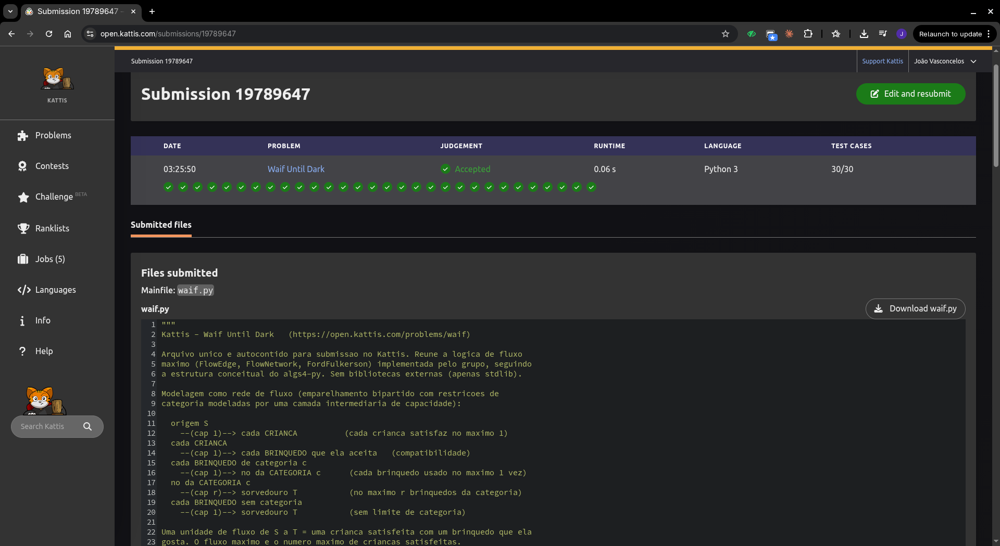

# Waif Until Dark — Fluxo Máximo

Trabalho Prático 3 (Unidade 3) — Resolução de Problemas com Grafos.

## Problema

- **Nome:** Waif Until Dark (Grupo K)
- **Link:** <https://open.kattis.com/problems/waif>
- **Plataforma de submissão:** Kattis (<https://open.kattis.com/>)

Uma creche tem `m` brinquedos e `n` crianças. Cada criança só brinca com um
subconjunto dos brinquedos. Alguns brinquedos pertencem a categorias e, por
categoria `j`, no máximo `r` de seus brinquedos podem ser usados. Cada brinquedo
serve a no máximo uma criança e cada criança fica satisfeita com no máximo um
brinquedo. Objetivo: **maximizar o número de crianças satisfeitas**.

## Integrantes do grupo

- João Victor Feijó Vasconcelos

## Linguagem

Python 3 (sem bibliotecas externas; lógica de fluxo implementada pelo grupo,
seguindo a estrutura conceitual do `algs4-py`: `FlowEdge`, `FlowNetwork`,
`FordFulkerson`).

## Como executar

```bash
cd src
python3 main.py < ../dados/entradas_do_problema.txt
# saída esperada: 2
```

A entrada é lida de `stdin` e a resposta é escrita em `stdout` (formato Kattis).
Para outro caso, redirecione qualquer arquivo de entrada para `main.py`.

> **Submissão no Kattis:** envie `src/main.py` — arquivo único e autocontido
> (as classes `FlowEdge`, `FlowNetwork` e `FordFulkerson` estão todas nele,
> usando apenas a biblioteca padrão do Python).

## Modelagem como rede de fluxo

Emparelhamento bipartido (crianças × brinquedos) com uma camada intermediária
de capacidade para as categorias.

| Componente | Representa |
| --- | --- |
| **Origem `S`** | ponto de injeção de fluxo; cada unidade que sai é uma criança que *pode* ser satisfeita |
| **Vértices criança** (`1..n`) | as crianças |
| **Vértices brinquedo** (`n+1..n+m`) | os brinquedos |
| **Vértices categoria** (`n+m+1..n+m+p`) | o limite agregado de cada categoria |
| **Sorvedouro `T`** | objetivo: chegar nele = uma criança satisfeita por um brinquedo válido |

### Origem, sorvedouro, arestas e capacidades

| Aresta | Capacidade | Por quê |
| --- | --- | --- |
| `S → criança` | `1` | cada criança fica satisfeita no máximo uma vez |
| `criança → brinquedo aceito` | `1` | compatibilidade; criança usa um brinquedo |
| `brinquedo (com categoria) → categoria` | `1` | cada brinquedo é usado por no máximo uma criança |
| `categoria → T` | `r` | no máximo `r` brinquedos daquela categoria podem ser usados |
| `brinquedo (sem categoria) → T` | `1` | brinquedo livre, sem limite de categoria, mas ainda 1 criança |

Capacidade **unitária** nas crianças e nos brinquedos força "uma decisão por
recurso"; capacidade **`r`** na aresta `categoria → T` é o único ponto onde a
restrição agregada de categoria atua. Brinquedos fora de categoria ligam direto
ao sorvedouro com capacidade 1.

## Algoritmo

**Ford-Fulkerson na variante Edmonds-Karp** (caminho aumentante por **BFS**).
Escolha do BFS: garante complexidade `O(V · E²)` independente das capacidades e
evita os caminhos ruins que o Ford-Fulkerson puro com DFS poderia escolher. Como
a rede é pequena (`n, m ≤ 100`), o desempenho é folgado e a versão por BFS é a
mais previsível.

### Papel do grafo residual

Cada `FlowEdge` é compartilhada pelos dois vértices e funciona como aresta
direta **e** reversa:

- residual direto (`v→w`) = `capacity − flow`;
- residual reverso (`w→v`) = `flow`.

Empurrar fluxo numa aresta reduz o residual direto e aumenta o reverso, o que
permite **desfazer** um pareamento anterior quando isso libera uma solução
melhor (testado: criança que "cede" seu brinquedo para outra ser atendida).

## Do fluxo para a resposta

O **valor do fluxo máximo** é diretamente o número máximo de crianças
satisfeitas — cada unidade de fluxo `S → ... → T` corresponde a um par
(criança, brinquedo) válido. É o que o programa imprime
([`main.py`](src/main.py): `print(FordFulkerson(G, S, T).value())`).

## Emparelhamento, reconstrução e corte mínimo

- **Emparelhamento:** o problema é, no fundo, um emparelhamento bipartido máximo
  (crianças × brinquedos) com o limite de categoria modelado pela camada
  intermediária. O fluxo máximo unitário nessa rede **é** o tamanho do
  emparelhamento máximo.
- **Reconstrução do pareamento** (não exigida pela saída, mas disponível): basta
  varrer as arestas `criança → brinquedo` com `flow > 0` — cada uma é um par
  (criança satisfeita, brinquedo usado).
- **Corte mínimo:** pelo teorema *max-flow min-cut*, o valor do fluxo iguala a
  capacidade do corte mínimo. A classe expõe `in_cut(v)`
  ([`main.py`](src/main.py)), que marca os vértices alcançáveis a partir de `S`
  no grafo residual final (lado-origem do corte). O conjunto saturado que separa
  esse lado de `T` explica *por que* algumas crianças ficam de fora (gargalo nas
  arestas `categoria → T` ou nos brinquedos disputados).

## Complexidade

- Vértices: `V = n + m + p + 2`.
- Arestas: `O(n·m + m + p)` (no pior caso `O(n·m)`).
- Tempo Edmonds-Karp: `O(V · E²)`; aqui `V, E` pequenos → trivial.
- Memória dominada pela lista de arestas residuais: `O(E)`.

## Casos especiais tratados

- `p = 0` (nenhuma categoria) → todo brinquedo liga direto a `T`.
- `r = 0` → categoria bloqueada, nenhum de seus brinquedos é usado.
- Brinquedo que ninguém aceita → fica sem aresta de entrada, não contribui.
- Recursos insuficientes / disputa pelo mesmo brinquedo → resolvido pelo fluxo.
- Necessidade de corrigir pareamento → arestas reversas do residual.

## Evidência de Accepted

Submissão **19789647** no Kattis — *Accepted*, Python 3, 30/30 casos de teste.


