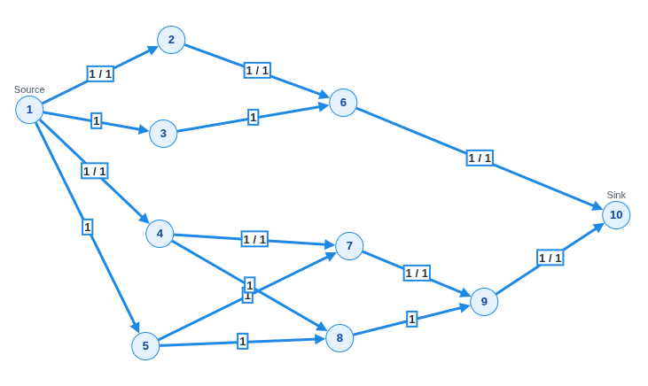

# Acompanhamento — Waif Until Dark

Resumo rápido do trabalho e da resolução. Detalhes completos no
[README da raiz](../README.md).

## O problema

- **Nome:** Waif Until Dark
- **Link:** <https://open.kattis.com/problems/waif>

Uma creche tem `m` brinquedos e `n` crianças. Cada criança só brinca com um
subconjunto dos brinquedos. Brinquedos podem pertencer a categorias e, por
categoria, no máximo `r` deles podem ser usados ao mesmo tempo. Cada brinquedo
serve a no máximo uma criança e cada criança fica satisfeita com no máximo um
brinquedo. **Objetivo:** maximizar o número de crianças satisfeitas.

## Como foi resolvido

Modelado como **fluxo máximo** (emparelhamento bipartido criança × brinquedo
com uma camada extra para o limite de categorias):

```
S --(1)--> criança --(1)--> brinquedo aceito
                                  |
              (com categoria) --(1)--> categoria --(r)--> T
              (sem categoria) --------------(1)----------> T
```

- `S → criança` (cap 1): cada criança satisfeita no máximo uma vez.
- `criança → brinquedo` (cap 1): só liga brinquedos que a criança aceita.
- `brinquedo → categoria` (cap 1): brinquedo usado no máximo uma vez.
- `categoria → T` (cap `r`): único ponto que aplica o limite agregado.
- `brinquedo sem categoria → T` (cap 1): vai direto ao sorvedouro.

Cada unidade de fluxo `S → … → T` é uma criança satisfeita, então o **valor do
fluxo máximo é a resposta**.

**Algoritmo:** Ford-Fulkerson na variante **Edmonds-Karp** (caminho aumentante
por BFS), `O(V·E²)`. Arestas reversas do grafo residual permitem desfazer um
pareamento quando isso libera uma solução melhor. Implementação própria em
Python 3 puro (`FlowEdge`, `FlowNetwork`, `FordFulkerson`), em
[../src/main.py](../src/main.py).

## Executar

```bash
cd src
python3 main.py < ../dados/entradas_do_problema.txt   # saída: 2
```


